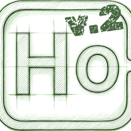

<div align="center">
  
  <h1>Hipotez v2.0</h1>
  <p>The Academic Project Planner — <em>Now with an Interactive Whiteboard Workspace!</em></p>
</div>

---

## 🇹🇷 Türkçe Tanıtım

Hipotez'in en büyük güncellemesi olan **v2.0 sürümünü** duyurmaktan gurur duyuyoruz! Eski sürümdeki basit "Not Defteri" yapısını tamamen rafa kaldırarak, her projeniz için uçsuz bucaksız, özgürce çalışabileceğiniz **Etkileşimli Beyaz Tahta (Interactive Whiteboard)** sistemine geçiş yaptık.

### ✨ Neler Yeni? (Öne Çıkan Özellikler)

*   **🎨 Sınırsız Beyaz Tahta Çalışma Alanı:** Sadece metin yazmakla kalmayın; şekiller çizin, tablolar oluşturun ve fikirlerinizi özgürce görselleştirin.
*   **🧮 Gelişmiş Matematik ve Formül Desteği (LaTeX):** Özellikle akademik çalışmalar için tahtanın herhangi bir yerine doğrudan matematiksel denklemler ve formüller ekleyin. Formüller LaTeX destekli ve tamamen düzenlenebilir.
*   **🖼️ Görsel (Resim) Ekleme:** Yerel bilgisayarınızdaki referans resimlerinizi, grafiklerinizi veya şemalarınızı doğrudan beyaz tahtaya ekleyin ve boyutlandırın.
*   **✍️ Zengin Metin Düzenleme:** Yazı boyutunu (punto), kalınlık (bold) ve eğik (italic) ayarlarını kolayca yapabileceğiniz yeni metin araç çubuğu.
*   **🌗 Dinamik Tema ve Renk Uyarlaması:** Aydınlık/Karanlık tahta modları arasında geçiş yapın. Çizimleriniz ve yazılarınız, arka plana göre okunabilir kalmak için otomatik olarak renk değiştirir (Örn: Siyah arka planda beyaz, beyaz arka planda siyah).
*   **📄 PDF Olarak Dışa Aktarma:** Tahtadaki tüm çalışmalarınızı tek tıkla PDF formatında bilgisayarınıza indirin.
*   **🚀 Sorunsuz Geçiş (Veri Taşıma):** Eski sürümdeki düz metin notlarınızı kaybetmezsiniz! Ayarlar menüsündeki "Tüm Eski Notları Tahtaya Aktar" butonu ile V1'deki notlarınızı otomatik olarak V2'nin beyaz tahta sistemine taşıyabilirsiniz.
*   **✨ Yeni Görünüm ve Logo:** Yepyeni H0 v2.0 logomuz ve cilalanmış arayüzümüz ile daha şık bir deneyim.

---

## 🇬🇧 English Release Notes

We are incredibly excited to announce **Hipotez v2.0**, the biggest update to date! We have completely retired the simple "Notepad" structure from the old version and transitioned to an infinite, freely customizable **Interactive Whiteboard** system for each of your projects.

### ✨ What's New? (Key Features)

*   **🎨 Infinite Whiteboard Workspace:** Go beyond plain text. Draw shapes, create diagrams, and visualize your ideas freely on a resizable, floating canvas.
*   **🧮 Advanced Math & Formula Support (LaTeX):** Built specifically for academic research, you can drop mathematical equations and formulas anywhere on the board. Formulas are fully editable and powered by LaTeX.
*   **🖼️ Image Uploads:** Seamlessly import reference images, charts, and diagrams from your local computer straight onto your whiteboard.
*   **✍️ Rich Text Formatting:** A brand-new text toolbar allows you to quickly adjust font sizes and apply bold or italic formatting to your text elements.
*   **🌗 Dynamic Theme Adaptation:** Switch between Dark and Light whiteboard modes instantly. Your drawings and text will intelligently invert colors to maintain perfect contrast (e.g., white text on a dark background, black text on a light background).
*   **📄 PDF Export:** Export your entire whiteboard canvas into a neat, high-quality PDF document with just one click.
*   **🚀 Seamless Migration:** You won't lose your old V1 text notes! Use the "Migrate Old Notes" button in the Settings menu to automatically convert all your legacy plain text notes into editable text blocks on the new V2 Whiteboard.
*   **✨ Fresh Look and Logo:** Enjoy our brand-new H0 v2.0 logo alongside a polished, smoother user interface.

---

### 💻 Nasıl Kurulur? / How to Install?

```bash
# Projeyi klonlayın / Clone the repository
git clone https://github.com/mehmet-ozcan/hipotez.git

# Klasöre girin / Enter the directory
cd hipotez

# Bağımlılıkları yükleyin / Install dependencies
npm install

# Uygulamayı başlatın / Start the application
npm start
```
